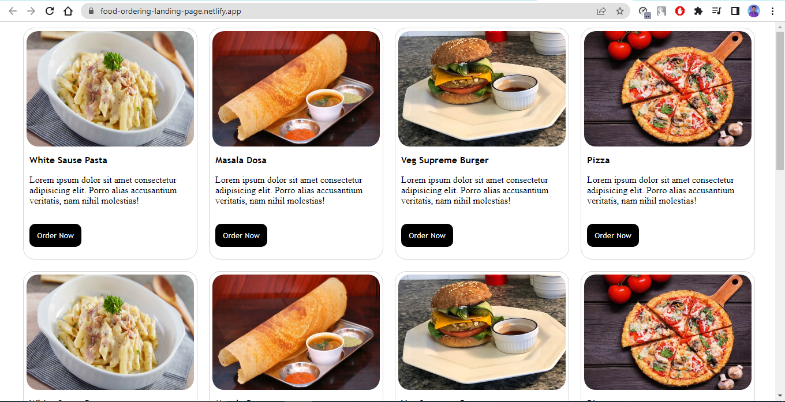

# 1st Day - Food Ordering Website

<b>It is a very simple landing page or ordering page made with 
"Box" & "Flex" model.</b>

## Used Technologies
<ul>
  <li>HTML 5</li>
  <li>CSS 3</li>
</ul>

## Screenshots

## Demo

[CLICK HERE](https://food-ordering-landing-page.netlify.app)

## Author

- [@subhranil002](https://www.github.com/subhranil002)

## Contribute

Contributions are always welcome!

Email Me - subhranil.chak.sc@gmail.com

To Start Contributing ...

## License

[MIT](https://choosealicense.com/licenses/mit/)

# 2nd Day - Currency Converter Website

<b>It is a very simple landing page where you can easily convert USD To INR.</b>

<b>Here I Used, 1 USD = 82.68 INR (As per the date 19/12/2022)</b>

## Used Technologies
<ul>
  <li>HTML 5</li>
  <li>CSS 3</li>
  <li>JS 13</li>
</ul>

## Screenshots

## Demo

[CLICK HERE](https://usd-to-inr-converter.netlify.app/)

## Author

- [@subhranil002](https://www.github.com/subhranil002)

## Contribute

Contributions are always welcome!

Email Me - subhranil.chak.sc@gmail.com

To Start Contributing ...

## License

[MIT](https://choosealicense.com/licenses/mit/)

